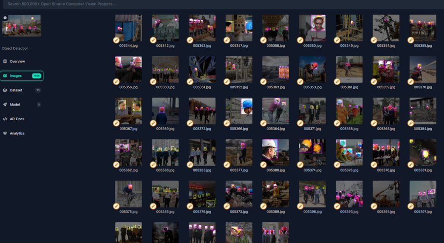
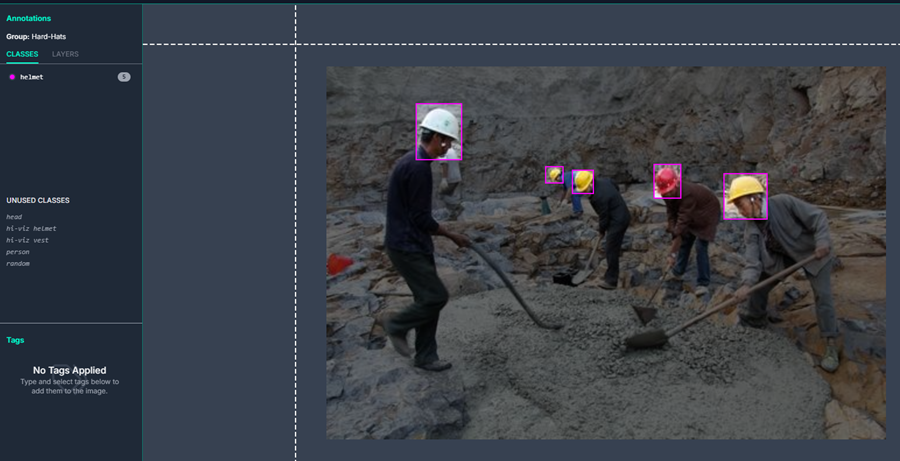
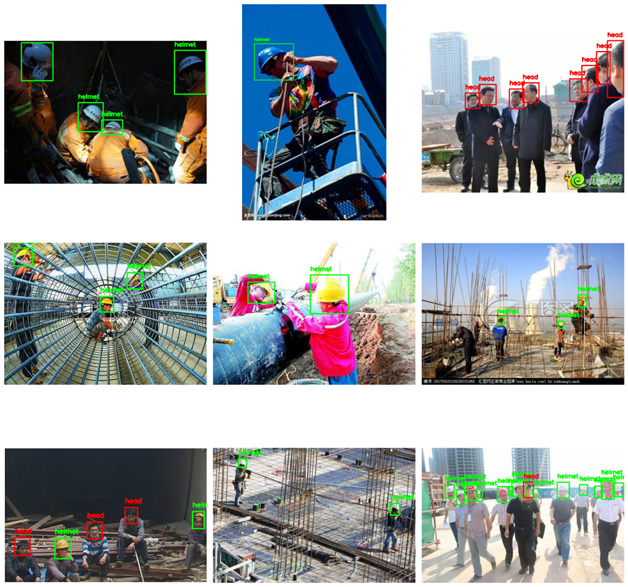

# Helmet Detection Dataset Analysis

The thesis has conducted surveys on different datasets, corresponding to practical application problems such as FaceMask Detection, Fall Detection, Drowsiness Detection, and Helmet Detection. Based on the performance of the model, I have chosen the Helmet Detection problem for evaluation, because this is the problem with the highest performance in all the survey cases.

## 1. Data Collection
Before starting, it is necessary to clearly define the goal and scope of the problem. For this thesis, the Helmet Detection problem requires data to include:

- Images of people wearing and not wearing helmets.
- Diverse contexts: indoors, outdoors, construction sites, factories, etc.
- Diverse shooting angles: top-down, bottom-up, frontal, and oblique.
- Reasonable resolution: ensures that the object details are clear enough but do not overload the memory when processing.

After surveying many datasets on the Internet, the thesis decided to choose the **“HardHat Universe”** dataset from Roboflow [26]. The dataset used includes **4912 images** in the training dataset. The dataset includes 5 types of labels:

- `head`
- `helmet`
- `hi-viz helmet`
- `hi-viz vest`
- `person`

**Figure 1**: Pre-labeled dataset from Roboflow

**Figure 2**: Images labeled as ‘helmet’ in the dataset

## 2. Data Preprocessing
To standardize the original problem with the goal of only recognizing **2 objects** (people wearing helmets and people without helmets), the dataset was cleaned by:

- Removing unnecessary labels.
- Eliminating empty images without labels.
- Retaining only images labeled `head` and `helmet`.

**Figure 3**: Some images in the dataset with Ground Truth after preprocessing.

### Dataset Link
[Download Dataset](https://drive.google.com/open?id=1xGNjuDCfGmQ1l9qKLF3T7QgdUgEBjLfH&usp=drive_copy)

### Reference
[HardHat Universe Dataset](https://universe.roboflow.com/universe-datasets/hard-hat-universe-0dy7t)
