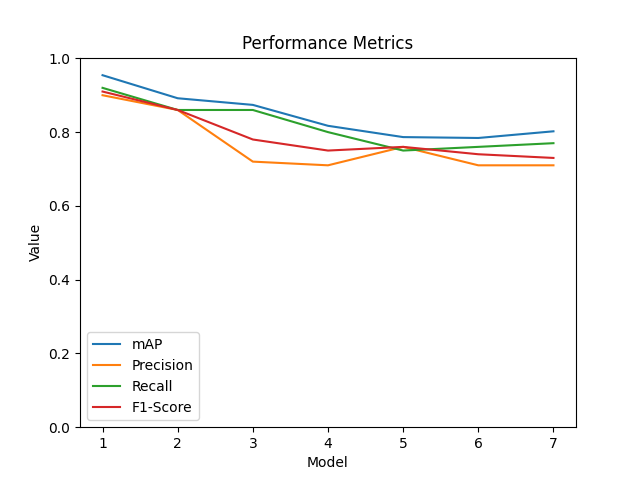
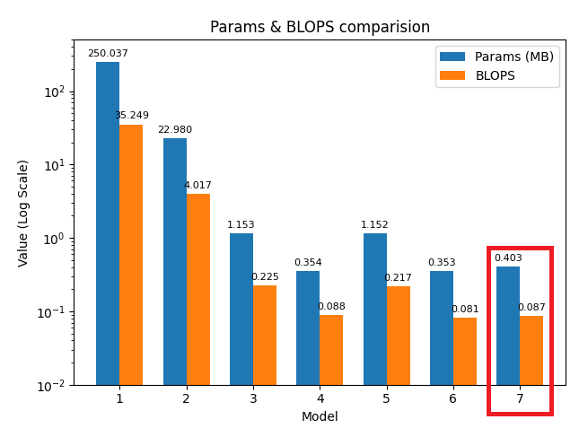
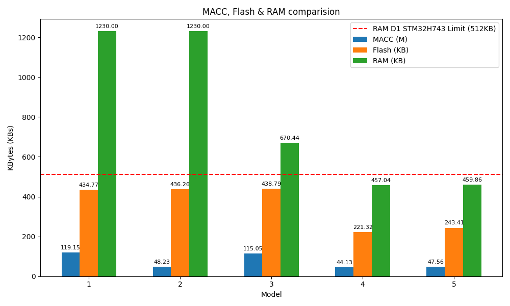
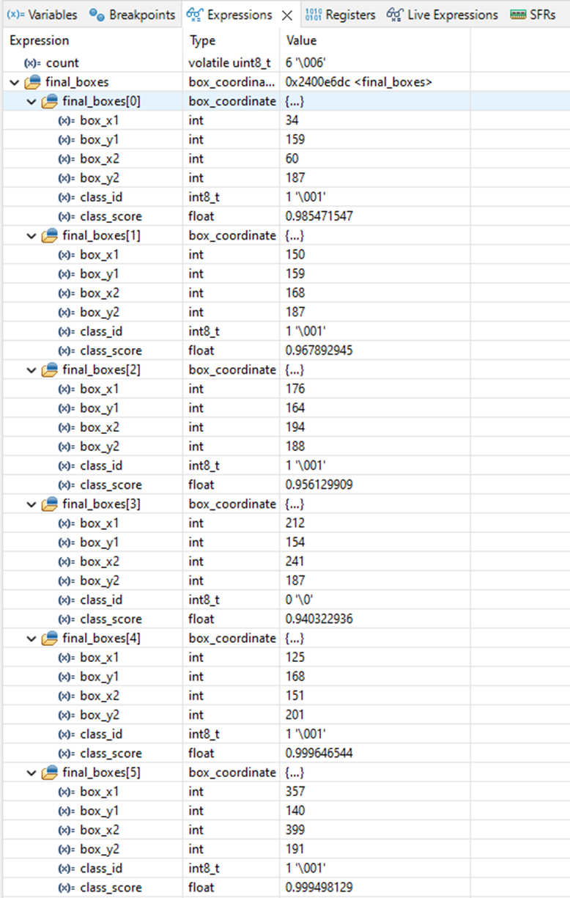
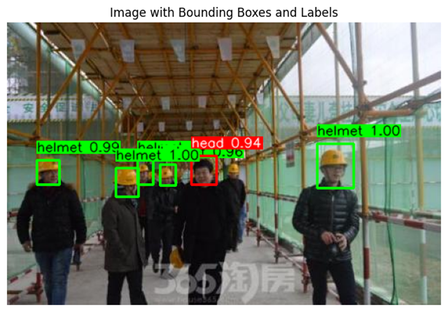

# MCU Model Deployment Demo

## **Overview**
This demo showcases the deployment of a custom YOLO-Fastest model on an STM32 microcontroller. The chosen custom model achieves inference speeds of approximately 2.5 FPS on the MCU.

## **Result**
> **Metrics Comparision**

| Model   | mAP (%) | Precision | Recall | F1-Score | Params (MB) | BLOPS  |
|---------|--------|-----------|--------|----------|-------------|--------|
| 1       | 95.43  | 0.9       | 0.92   | 0.91     | 250.037     | 35.249 |
| 2       | 89.18  | 0.86      | 0.86   | 0.86     | 22.980      | 4.017  |
| 3       | 87.38  | 0.72      | 0.86   | 0.78     | 1.153       | 0.225  |
| 4       | 81.71  | 0.71      | 0.80   | 0.75     | 0.354       | 0.088  |
| 5       | 78.65  | 0.76      | 0.75   | 0.76     | 1.152       | 0.217  |
| 6       | 78.41  | 0.71      | 0.76   | 0.74     | 0.353       | 0.081  |
| 7       | **80.22**  | **0.71**  | **0.77** | **0.73**  | **0.403**  | **0.087**  |

> **Params & BLOPS comparision**

- **Model 1**: YOLOv4 model  
- **Model 2**: YOLOv4-tiny model  
- **Model 3**: Original model (YOLO-Fastest)  
- **Model 4**: Original model combined with pruning  
- **Model 5**: Original model combined with input grayscale  
- **Model 6**: Original model combined with pruning and input grayscale  
- **Model 7**: Original model combined with pruning, input grayscale, and SAM block (**model selected for hardware deployment**)  

> **MACC, Flash & RAM consume on STM32 comparision**

| Model   | MACC (M) | Flash (KB) | RAM (KB) | STM32H743 |
|---------|----------|------------|----------|-----------|
| 1       | 119.15   | 434.77     | **1,230.0** | ❌ |
| 2       | 48.23    | 436.26     | **1,230.0** | ❌ |
| 3       | 115.053  | 438.79     | **670.44** | ❌ |
| 4       | 44.13    | 221.32     | 457.04   | ✅ |
| **5**   | **47.56** | **243.41** | **459.86** | ✅ |

- **Model 1**: Original model (YOLO-Fastest)  
- **Model 2**: Original model combined with pruning  
- **Model 3**:  Original model combined with input grayscale  
- **Model 4**: Original model combined with pruning and input grayscale  
- **Model 5**: Original model combined with pruning, input grayscale, and SAM block (**model selected for hardware deployment**)

## **Demo**
> **YOLO output decoding**

## Requirements
- STM32 H74x/H75x MCU
- Pretrained YOLO-Fastest model
- Camera module OV767 or other module (for testing)
- LCD TFT ILI9341 (for testing)

## Others
This experimental demo illustrates the model's deployment on an MCU, capturing real-time camera input and rendering detections on a TFT LCD at approximately 10 FPS. However, this test version is not used in my thesis due to its lower mean Average Precision (mAP), which impacts detection accuracy.
- **Real-time Inference:** Performs object detection on a live camera feed.
- **Optimized for MCU:** Uses YOLO-Fastest to ensure efficient inference within hardware constraints.
- **TFT LCD Display:** Outputs detection results directly to a screen for visualization.

> FaceMask Detection

https://github.com/user-attachments/assets/8472b4e9-d70c-4f9b-bd1e-22a9e4152221

---

© 2025 Nhat-Trieu Huynh-Pham
