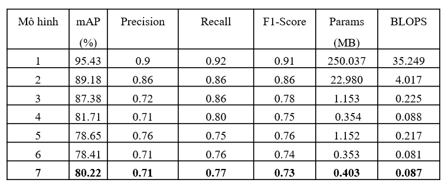

# MCU Model Deployment Demo

## Overview
This demo showcases the deployment of a custom YOLO-Fastest model on an STM32 microcontroller. The chosen custom model achieves inference speeds of approximately 2.5 FPS on the MCU.

## Result
> Metrics Comparision

> Params & BLOPS comparision

Model 1: YOLOv4 model  
Model 2: YOLOv4-tiny model  
Model 3: Original model (YOLO-Fastest)  
Model 4: Original model combined with pruning  
Model 5: Original model combined with input grayscale  
Model 6: Original model combined with pruning and input grayscale  
Model 7: Original model combined with pruning, input grayscale, and SAM block (model selected for hardware deployment)

> MACC, Flash & RAM consume on STM32 comparision

Model 1: Original model (YOLO-Fastest)  
Model 2: Original model combined with pruning  
Model 3: Original model combined with input grayscale  
Model 4: Original model combined with pruning and input grayscale  
Model 5: Original model combined with pruning, input grayscale, and SAM block (model selected for hardware deployment)

## Demo
> YOLO output decoding

## Requirements
- STM32 H74x/H75x MCU
- Pretrained YOLO-Fastest model
- Camera module OV767 or other module (for testing)
- LCD TFT ILI9341 (for testing)

## Others
This experimental demo illustrates the model's deployment on an MCU, capturing real-time camera input and rendering detections on a TFT LCD at approximately 10 FPS. However, this test version is not used in my thesis due to its lower mean Average Precision (mAP), which impacts detection accuracy.
- **Real-time Inference:** Performs object detection on a live camera feed.
- **Optimized for MCU:** Uses YOLO-Fastest to ensure efficient inference within hardware constraints.
- **TFT LCD Display:** Outputs detection results directly to a screen for visualization.

> FaceMask Detection

https://github.com/user-attachments/assets/8472b4e9-d70c-4f9b-bd1e-22a9e4152221

---

© 2025 Nhat-Trieu Huynh-Pham
